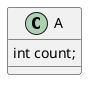

# Spring的对象代理


##  什么是代理

代理是指由一个主体代替另一个主体完成某些事情。代理的根本目的仍是完成被代理主体的任务。

从程序的角度来说，满足下面几个条件的情况下，我们就称A是B的代理：
```
    1. A和B对外提供一样的接口
    2. A执行时的主要目的是完成B的业务逻辑
```

看一个示例：
```Java
// 被代理
class Raw {
    public void sayHello() {
        System.out.println("F***");
    }
}
// 代理
class Proxy {
    Raw raw;

    Proxy(Raw raw) {
        this.raw = raw;
    }

    public void sayHello() {
        System.out.print("Don't say ");
        raw.sayHello();
    }

    public static void main(String args[]) {
        new Proxy(new Raw()).sayHello();
    }
}
```
这个示例有一个问题。Proxy虽然可以代理Raw的sayHello行为，但是并不能在调用Raw的地方被使用（由于Java是静态类型语言）。所以在Java里我们一般通过实现被代理类的超接口，或者继承被代理类的方式来实现代理。
```Java
// 被代理接口
interface IRaw { void sayHello(); }
// 被代理类
class Raw implements IRaw {
    public void sayHello() { ... }
}
// 接口代理
class ProxyI implements IRaw {
    IRaw raw;
    ProxyI(IRaw raw) {
        this.raw = raw;
    }
    public void sayHello() {
        ...
        raw.sayHello();
    }
}
// 继承代理
class ProxyC extends Raw {
    Raw raw;
    ProxyC(Raw raw) {
        this.raw = raw;
    }
    public void sayHello() {
        ...
        raw.sayHello();
    }
}
// 调用示例
class Main {
    static void say(Raw  raw) { raw.sayHello(); }
    static void say(IRaw raw) { raw.sayHello(); }
    public static void main(String args[]) {
        say(new Proxy(new Raw()));  // 编译错误，因为Proxy既不能作为Raw也不能作为IRaw使用
        say(new ProxyI(new Raw())); // ok
        say(new ProxyC(new Raw())); // ok
    }
}
```

## 动态代理
代理可以在不改变原有类的情况下添加逻辑，增强原有类的功能。但是如果以手写代码的方式实现代理，我们将需要为不同的被代理类实现同一代理逻辑的不同代理类版本，我们还要处理代理逻辑组合的问题。代理类将呈指数增长。所以我们一般使用动态生成代理的方式实现代理。

所谓动态代理就是在运行时动态生成代理。

现在假设我们希望记录方法执行的时间，我们可以针对Raw或者IRaw编写一个代理对象：
```Java
class TimerProxy implements IRaw {
    ...
    public void sayHello () {
        long start = System.currentTimeMillis();
        raw.sayHello();
        System.out.println("$interface.$m.name Taking " + (System.currentTimeMillis() - start));
    }
}
```
如果我们还有其它的几十个类几百个方法，我们肯定不想为每个类都编写一个TimerProxy类。我们可以使用反射的方式来生成代理类的代码，然后使用程序编译和加载生成的代理类（关于运行时编译代码和加载类的相关信息可以搜索JavaCompiler）。
```Java
// 生成代理的模板
class TimerProxy implements $interface {

    $interface target;

    TimerProxy($interface target) {
        this.target = target;
    }

    #for m in $publicMethods
        $m.modifiers $m.name($m.args) {
            long start = System.currentTimeMillis();
            target.$m.name($m.args);
            System.out.println("$interface.$m.name Taking " + (System.currentTimeMillis() - start));
        }
    #end
}
// 生成代理类
class ProxyCreator {
    <T> Class<? extends T> getProxy(String templateName, Class<T> interf) {
        String code = buildCode(getTemplate(templateName), interf);
        String qulifiedClassName = compile(code);
        return Class.forName(qulifiedClassName).asSubclass(interf);
    }

    // 调用示例
    public static void main(String args[]) {
        Class<IRaw> rawProxy = getProxy("timerProxy", IRaw.class);
        rawProxy.getConstructor(IRaw.class).newInstance(new Raw()).sayHello();
    }
}
```
实际生产中我们使用直接生成字节码的方式生成代理类，不必生成代理类的代码再进编译。常用的代理生成技术有Java标准库提供的代理技术和Cglib库。

## Java标准库的动态代理
Java标准库的动态代理是基于接口的，被代理类需要实现接口才能被代理。动态织入的代理逻辑需要实现InvocationHandler接口。
下面是一个标准库动态代理使用的示例：
```Java
public class TimerProxy implements InvocationHandler {

    private Object target;

    public TimerProxy() {
        this.target = target;
    }

    @Override
    public Object invoke(Object proxy, Method method, Object[] args) throws Throwable {
        long start = System.currentTimeMillis();
        Object result = method.invoke(target, args);
        System.out.println("_._ Taking " + (System.currentTimeMillis() - start));
        return result;
    }

    public static void main(String args[]) {
        IRaw rawProxy = (IRaw) Proxy.newProxyInstance(
            this.getClass().getClassLoader(),
            new Class[] { IRaw.class },
            new TimerProxy());
        rawProxy.sayHello();
    }
}

// 生成的代理类（简化版，去掉了Object类的方法和异常处理）
public final class $Proxy0 extends Proxy implements IRaw {

    private static Method m1;

    public $Proxy0(InvocationHandler var1) {
        super(var1);
    }

    public final void sayHello() throws  {
        super.h.invoke(this, m1, (Object[]) null);
    }

    static {
        m1 = Class.forName("com.songfeifan.test.spring.core.IRaw").getMethod("sayHello");
    }
}
```

## Cglib动态代理
Cglib动态代理使用继承和方法回调的方式实现，动态织入的代理逻辑需要实现MethodInterceptor接口。
下面是一个Cglib库动态代理使用的示例：
```Java
public TimerProxy implements MethodInterceptor {

    @Override
    public Object intercept(Object obj, Method method, Object[] args, MethodProxy proxy) throws Throwable {
        long start = System.currentTimeMillis();
        Object result = proxy.invokeSuper(obj, args);        
        System.out.println("_._ Taking " + (System.currentTimeMillis() - start));
        return result;
    }

    public static void main(String[] args) {
        Enhancer enhancer = new Enhancer();
        enhancer.setSuperclass(Raw.class);
        enhancer.setCallback(new TimerProxy());
        Raw raw = (Raw) enhancer.create();
        raw.sayHello();
    }
}

// 生成的代理类（只取其中一部分，整个结构比较乱。标准库到底要优雅得多）
public class Raw$$EnhancerByCGLIB$$7dc5842d extends Raw implements Factory {

    public final void sayHello() {
        MethodInterceptor mInterceptor = this.CGLIB$CALLBACK_0;
        if (mInterceptor != null) {
            mInterceptor.intercept(this, CGLIB$sayHello$0$Method, CGLIB$emptyArgs, CGLIB$sayHello$0$Proxy);
        } else {
            super.sayHello();
        }
    }
}
```

## Spring的动态代理
Spring依靠动态代理的技术为对象添加增强逻辑，实现面向切面的编程方式。Spring为被依赖的对象注入依赖对象的增强代理，实现增强功能的调用。换句话说，只有被Spring容器管理的对象才有可能使用Spring的增强功能，因为要使用增强功能，必须使用Spring生成的代理对象。

Spring使用Java标准库或者Cglib库实现动态代理。基本的选择逻辑如下：
```
1. 如果被代理类被@Configuration标记，使用Cglib实现（特殊情况，后面会说明）
2. 如果类型被认为不需要增强功能，使用类型本身
3. 如果代理类实现了Spring定义的特殊接口（BeanFactoryAware之类的）之外的接口，或者本身是一个接口，使用Java标准库实现
4. 之外，使用Cglib实现
5. 可能存在的其它逻辑
```

一般情况下，Spring使用组合的方式实现被代理类的方法调用。大致上逻辑可以视作：
```Java
// 代理类的大概逻辑
class RawP extends Raw {

    private Raw target;

    RawP(Raw target) {
        this.target = target;
    }

    public void sayHello() {
        target.sayHello();
        System.out.pringln("sayHello proxied");
    }
}
```

使用这种方式，被代理类在方法体内调用自身的方法的时候，增强功能将会失效。
我们假设Raw类还有一个sayHelloAgain方法，调用自身的sayHello方法。
```Java
class Raw {
    ...
    public void sayHelloAgain() {
        sayHello();
    }
}

// 代理类
class RawP extends Raw {
    ...
    public void sayHelloAgain() {
        target.sayHello();
        System.out.pringln("sayHelloAgain proxied");
    }

    public static void main(String args[]) {
        Raw raw = new RawP(new Raw());
        /*
         * 输出
         *    hello
         *    sayHello proxied
         * 没问题
         */
        raw.sayHello();
        /*
         * 输出
         *    hello
         *    sayHelloAgain proxied
         * 我们实际希望得到的输出
         *    hello
         *    sayHello proxied
         *    sayHelloAgain proxied
         */
        raw.sayHelloAgain();
    }
}
```

当我们使用Java config的方式配置Spring时，我们需要被代理类在调用自身方法时是调用的代理类的方法。因为我们需要被@Bean标记的方法每次调用都返回同一个对象（如果是单例模式）。
```Java
@Configuration
class SysConfiguration {
    @Bean
    public Raw raw() {
        return new RawP();
    }

    public boolean check() {
        return raw() == raw(); // must be true
    }
}
```
所以被@Configuration标记的类的代理使用继承的方式实现，使用子类方法会覆盖掉父类方法的特性。
```Java
// 代理类
class RawP extends Raw {

    public void sayHello() {
        super.sayHello();
        System.out.pringln("sayHelloAgain proxied");
    }
    public void sayHelloAgain() {
        super.sayHello();
        System.out.pringln("sayHelloAgain proxied");
    }

    public static void main(String args[]) {
        Raw raw = new RawP(new Raw());
        /*
         * 输出
         *    hello
         *    sayHello proxied
         *    sayHelloAgain proxied
         *
         * 因为Raw的sayHello方法已经在代理类中被覆盖了
         */
        raw.sayHelloAgain();
    }
}
```

## 为什么有时候Spring的增强功能不会起作用
Spring的增强功能不起作用主要可以分为两种情况。第一种情况是增强功能没有被启用，比如启用缓存需要@EnableCaching注解（Spring boot）。第二种情况是增强功能虽然被启用，但是实际调用方法时没有使用代理类调用方法。
没有使用代理类的一些典型情况：
```
1. 使用类名调用静态方法，比如Raw.staticMethod()
2. 在被代理类的方法中调用自身的方法。大部分时候Spring使用组合的方式实现代理。
3. 试图增强非接口的方法，private方法等。
   由于我们一般使用接口的方式实现服务层，所以这种情况往往会变成第二种情况。
```
